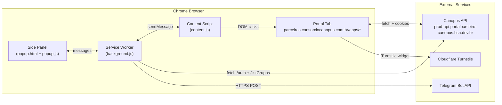
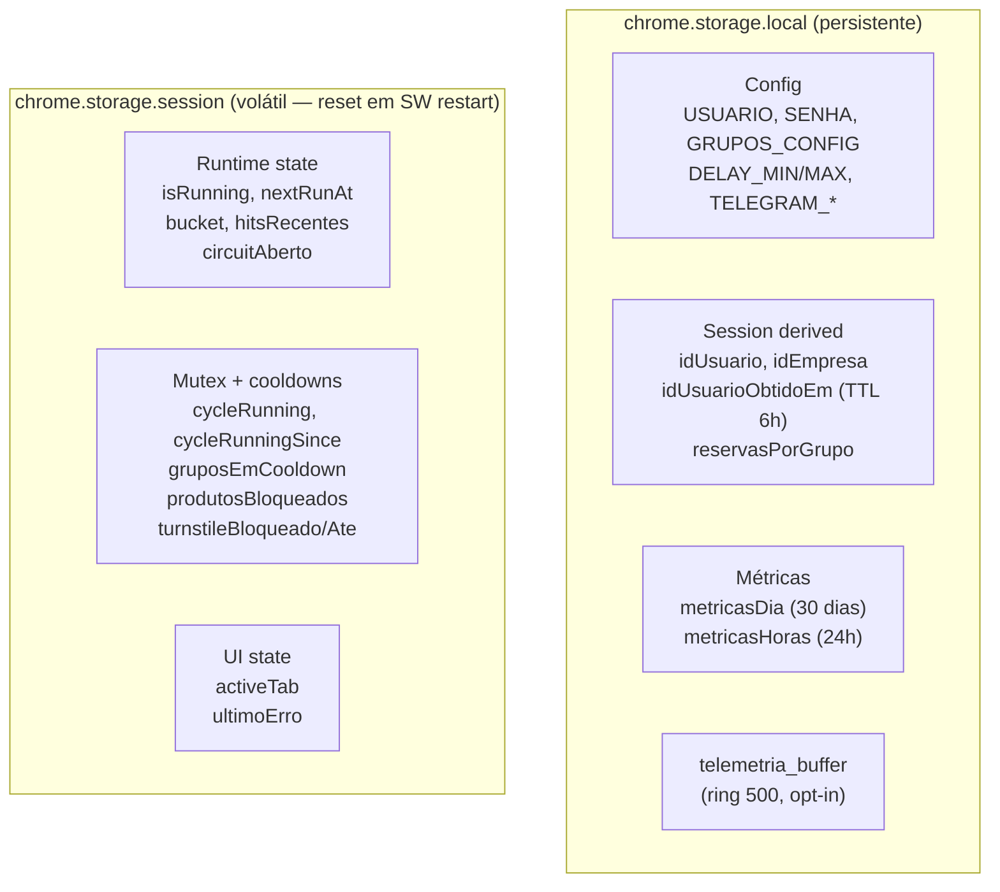

# Arquitetura diagram no README via Mermaid

## Context

README atual tem seção "Como funciona por dentro" descrevendo arquitetura em prosa + tabelas. CLAUDE.md tem detalhamento técnico interno. Falta **representação visual** mostrando:

- Componentes (SW background, content-script, side panel popup, portal Canopus, backend API)
- Fluxo de dados entre eles (cycle.start → buscarGrupos → detectados → reservarComLimite → reservarViaTab → DOM → toast → cycle.end)
- Fluxo do Turnstile interativo (escala → pause → cliente clica → resume)
- Storage layout (local vs session)

Diagram facilita onboarding de contributor e revisão de arquitetura. GitHub renderiza Mermaid nativamente em `.md`, zero deps.

## Motivation

- **+2 documentação**: README com diagrama parece mais profissional, ajuda reviewers entenderem em 30s o que leria 5min em prosa.
- **Score impact alvo**: +2 (Documentação 90→92).

## Approach

Adicionar **3 diagramas Mermaid** no README, em nova seção `## 🏗 Arquitetura` posicionada entre "Como usar" e "Como funciona por dentro":

### Diagrama 1 — Component view (flowchart LR)

Componentes principais e dependências:



### Diagrama 2 — Reserva flow (sequenceDiagram)

Sequência completa do ciclo de reserva:

```mermaid
sequenceDiagram
  participant SW as Service Worker
  participant CS as Content Script
  participant DOM as Portal DOM
  participant CF as Cloudflare Turnstile

  Note over SW: runPollingLoop dispara<br/>(setTimeout / chrome.alarms)
  SW->>SW: cycle.start + mutex cycleRunning
  SW->>+API: /reservas/listGruposReserva
  API-->>-SW: { data: [grupos] }
  SW->>SW: filter detectados (config + dedup + cooldown)
  loop para cada grupo detectado
    SW->>+CS: sendMessage("reservar_via_dom", grupo)
    CS->>DOM: click "Nova Reserva"
    DOM->>DOM: abre modal "Selecione um Grupo"
    CS->>DOM: click linha do CD_Grupo
    DOM->>DOM: abre modal "Dados da Reserva"
    DOM->>+CF: render Turnstile widget
    CF-->>-DOM: token resolvido (~7s)
    CS->>DOM: click "Reservar"
    DOM-->>-CS: toast "Reserva efetuada com sucesso!"
    CS-->>SW: { ok: true, reserva }
    SW->>SW: incrementa reservasPorGrupo
  end
  SW->>SW: cycle.end + métricas + flush telemetria
```

### Diagrama 3 — Storage layout (flowchart TD)

Separação de storage com TTL:



## Files

**Modificar:**
- `README.md` — adicionar seção `## 🏗 Arquitetura` antes de `## Como funciona por dentro`, com os 3 Mermaid blocks intercalados com 1 parágrafo de contexto cada
- `CHANGELOG.md` — registrar como `docs:` na próxima versão

**Não criar:**
- Diagrams ficam inline no README — sem arquivos `.mmd` separados (Mermaid renderiza nativamente no GitHub)

## Verification

1. Visualizar `README.md` no GitHub web (não em VSCode preview que não renderiza Mermaid sem extensão) — confirmar 3 diagramas renderizam corretamente.
2. Cada diagram tem alt text via comentário ao redor pra acessibilidade.
3. Validar sintaxe Mermaid em <https://mermaid.live> antes de commit.
4. Componentes do diagrama 1 batem com files reais (`extension/background.js`, `extension/content.js`, `extension/popup.html`).
5. Sequência do diagrama 2 bate com `runMonitorCycle` em `background.js` (linhas ~1078-1250).
6. Storage layout do diagrama 3 confere com tabela "Storage layout" em `CLAUDE.md`.

## Risks

- **Mermaid quebra em themes escuros do GitHub**: cores default podem ficar ruim. Mitigação: usar cores neutras, evitar fill explícito.
- **Diagrama desatualiza com refactors (lote 01)**: documentação tende a ficar stale. Mitigação: incluir diagrama em PRs que mudam arquitetura.
- **VS Code preview não renderiza Mermaid sem extensão**: contributor local pode não ver. Aceitável, GitHub web renderiza.

## Out of scope

- Diagramas em PNG/SVG estáticos (Mermaid inline é suficiente)
- Diagrama de telemetria (dataflow events) — fica pra futuro se justificado
- C4 model (system/container/component/code) — overkill pra extensão single-binary
- Animated diagrams ou videos

## Effort breakdown

| Subtask | Estimativa |
|---------|------------|
| Validar sintaxe dos 3 diagramas em mermaid.live | 30min |
| Escrever parágrafos de contexto pra cada diagrama | 30min |
| Editar README inserindo seção | 30min |
| Visualizar no GitHub web, ajustar formatação | 30min |
| Update CHANGELOG | 15min |
| **Total** | **~2h** (S) |

## References

- Mermaid GitHub support: <https://github.blog/2022-02-14-include-diagrams-markdown-files-mermaid/>
- Mermaid live editor: <https://mermaid.live>
- Mermaid syntax flowchart: <https://mermaid.js.org/syntax/flowchart.html>
- Mermaid syntax sequence: <https://mermaid.js.org/syntax/sequenceDiagram.html>
